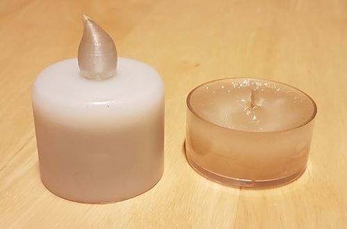
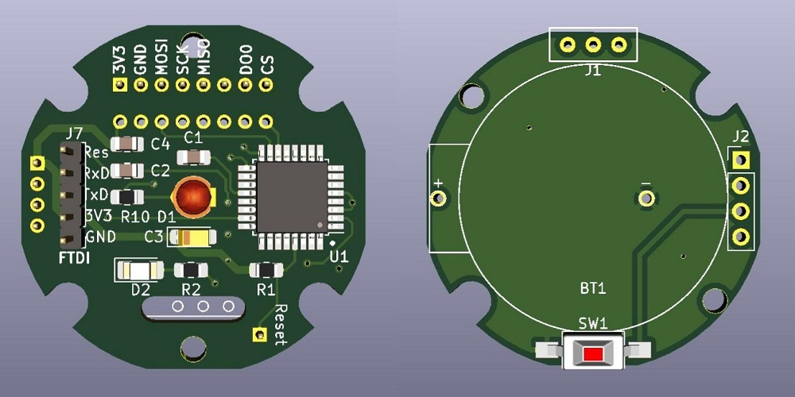

Dieses Werk ist lizenziert unter einer [Creative Commons Namensnennung - Nicht-kommerziell - Weitergabe unter gleichen Bedingungen 4.0 International Lizenz](http://creativecommons.org/licenses/by-nc-sa/4.0/).

# LED-Teelicht mit Homematic-Anbindung

## Beschreibung:
Diese Projekt beschreibt den Aufbau eines LED Teelichts / einer LED Kerze mit Homematic-Anbindung. 
Ziel war, dass die Kerze im Durchmesser einem regulären Teelicht entspricht 
 
## Platinen:

 

## Bauteile:
### Benötigte Bauteile für Hauptplatine:
| Anzahl | Ref | Typ | Bezeichnung |
|----|----|----|----|
1 | U1 | AVR | [ATMega 328P-AU](https://www.reichelt.de/mcu-atmega-avr-risc-32-kb-20-mhz-tqfp-32-atmega-328p-au-p119684.html)
1 | IC1 | Funkmodul | Funkmodul CC1101 868MHz
1 | D1 | LED | 3mm Flacker-LED
1 | D2 | SMD LED rot 1206 | [RND 135-00188](https://www.reichelt.de/led-smd-1206-rot-115-mcd-rnd-135-00188-p263784.html)
1 | R1 | Widerstand 10k 0805 | [RND 0805 1 10K](https://www.reichelt.de/smd-widerstand-0805-10-kohm-125-mw-1-rnd-0805-1-10k-p183251.html)
1 | R2 | Widerstand 1k 0805 | [RND 0805 1 1,0K](https://www.reichelt.de/smd-widerstand-0805-1-0-kohm-125-mw-1-rnd-0805-1-1-0k-p183228.html)
1 | R10 | Widerstand 47Ohm 0805 | [RND 0805 1 47](https://www.reichelt.de/smd-widerstand-0805-47-ohm-125-mw-1-rnd-0805-1-47-p183165.html)
3 | C1,C2,C4 | Kondensator 100nF 0805 | [X7R-G0805 100N](https://www.reichelt.de/smd-vielschicht-keramikkondensator-100n-10-x7r-g0805-100n-p31879.html)
1 | C3 | Kondensator 10µF 0805 | [X5R-G0805 10/16](https://www.reichelt.de/smd-vielschichtkondensator-g0805-10-f-16v-x5r-g0805-10-16-p89734.html)
1 | J2 | Stiftleise RM2,00 | [MPE 150-1-004](https://www.reichelt.de/stiftleisten-2-00-mm-1x04-gerade-mpe-150-1-004-p119965.html)
1 | SW1 | SMD-Taster | Reset-Taster (Optinal)
 

### Benötigte Bauteile für Batterieplatine:
| Anzahl | Ref | Typ | Bezeichnung |
|----|----|----|----|
