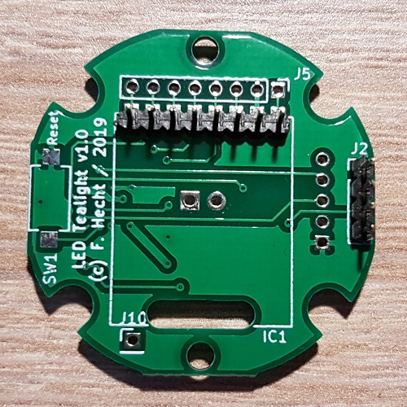

Dieses Werk ist lizenziert unter einer [Creative Commons Namensnennung - Nicht-kommerziell - Weitergabe unter gleichen Bedingungen 4.0 International Lizenz](http://creativecommons.org/licenses/by-nc-sa/4.0/).

# LED-Teelicht mit Homematic-Anbindung

## Beschreibung:
Diese Projekt beschreibt den Aufbau eines LED Teelichts / einer LED Kerze mit Homematic-Anbindung. 
Ziel war, dass die Kerze im Durchmesser einem regulären Teelicht entspricht 
 

## Funktionen:
3pol Schiebeschalter auf der Batterieplatine: Ein- und Ausschalter (trennt die Batteriespannung) 
SW1 auf der Batterieplatine: Config-Taster & manuelles Ein- und Ausschalten der Flacker-LED 
SW1 auf der Hautplatine: Reset-Taster (optional) 
 

## Platinen:

 

## Schaltplan:
[Schematics_LED-Teelicht_v1.0.pdf](Schematics_LED-Teelicht_v1.0.pdf) 
 

## Gehäuse:
Das Gehäuse hat Tonischabloni erstellt und ist auf Thingiverse: 
[https://www.thingiverse.com/thing:3974933](https://www.thingiverse.com/thing:3974933) 
 

## Bauteile:
### Benötigte Bauteile für Hauptplatine:
| Anzahl | Ref | Typ | Bezeichnung |
|----|----|----|----|
1 | U1 | AVR | [ATMega 328P-AU](https://www.reichelt.de/mcu-atmega-avr-risc-32-kb-20-mhz-tqfp-32-atmega-328p-au-p119684.html)
1 | IC1 | Funkmodul | Funkmodul CC1101 868MHz
1 | IC1 | Stiftleise RM2,00 | [BKL 10120732](https://www.reichelt.de/stiftleiste-2-00mm-1x8-gerade-bkl-10120732-p262754.html)
1 | D1 | LED | 3mm Flacker-LED
1 | D2 | SMD LED rot 1206 | [RND 135-00188](https://www.reichelt.de/led-smd-1206-rot-115-mcd-rnd-135-00188-p263784.html)
1 | R1 | Widerstand 10k 0805 | [RND 0805 1 10K](https://www.reichelt.de/smd-widerstand-0805-10-kohm-125-mw-1-rnd-0805-1-10k-p183251.html)
1 | R2 | Widerstand 1k 0805 | [RND 0805 1 1,0K](https://www.reichelt.de/smd-widerstand-0805-1-0-kohm-125-mw-1-rnd-0805-1-1-0k-p183228.html)
1 | R10 | Widerstand 47Ohm 0805 | [RND 0805 1 47](https://www.reichelt.de/smd-widerstand-0805-47-ohm-125-mw-1-rnd-0805-1-47-p183165.html)
3 | C1,C2,C4 | Kondensator 100nF 0805 | [X7R-G0805 100N](https://www.reichelt.de/smd-vielschicht-keramikkondensator-100n-10-x7r-g0805-100n-p31879.html)
1 | C3 | Kondensator 10µF 0805 | [X5R-G0805 10/16](https://www.reichelt.de/smd-vielschichtkondensator-g0805-10-f-16v-x5r-g0805-10-16-p89734.html)
1 | J2 | Stiftleise RM2,00 | [MPE 150-1-004](https://www.reichelt.de/stiftleisten-2-00-mm-1x04-gerade-mpe-150-1-004-p119965.html)
1 | SW1 | SMD-Taster | Reset-Taster (optional)
 

### Benötigte Bauteile für Batterieplatine:
| Anzahl | Ref | Typ | Bezeichnung |
|----|----|----|----|
| 1 | BT1 | CR2477 | Batteriehalter CR2477 |
| 1 | J1 | 3pol. Schiebeschalter | [SS ESP101](https://www.reichelt.de/schiebeschalter-1x-um-stehend-print-rm-2-54-ss-esp101-p112178.html)|
| 1 | J2 | Buchsenleise RM2,00 | [MPE 156-1-004](https://www.reichelt.de/buchsenleisten-2-00-mm-1x04-gerade-mpe-156-1-004-p119985.html) |
1 | SW1 | SMD-Taster | Config-Taster
 

## Aufbau:
### Batterieplatine:
Das Bestücken der Batterieplatine ist relativ einfach erklärt. 
Man sollte die Bauteile in dieser Reihenfolge auflöten: 
1. CR2477 Batteriehalter einlöten 
2. 3pol Schiebeschalter und Config-Taster auflöten 
3. 4pol Buchsenleiste auf der Lötseite einlöten (steht dann nach unten) 

 

### Hauptplatine:
#### 1. Bestücken der SMD-Bauteile:
Im ersten Schritt werden die SMD-Bauteile auf der Hauptplatine bestückt. 
Speziell beim Atmega ist es wichtig, dass es keine Kurzschlüsse gibt. 
Ich empfehle nach dem Löten die Platine mit einem Leiterplattenreiniger gründlich zu reinigen (besonders im Bereicht vom Atmega). 
Die besten Ergebnisse habe ich damit erzielt, die Platine für ein paar Minuten in Leiterplattenreiniger einzulegen und mit einem Pinsel gründlich zu reinigen. 

 

#### 2. Fuses und Bootloader flashen:
Das Flashen der Fuses und des Bootloaders erfolgt über die Lötaugen von J5. 
Die Pinbelegung ist auf der Platine aufgedruckt. 
Man muss sich lediglich ein Adapterkabel für den In Circuit Programmer anfertigen. 
 
Das Flashen erfolgt mit folgenden Befehlen. 
Die Pfade sind ggf. entsprechend anzupassen. 
<code>cd C:\Program Files (x86)\Arduino\hardware\tools\avr\bin</code>
 
<code>.\avrdude -C ..\etc\avrdude.conf -v -p m328p -P com10 -c stk500v1 -b 19200 -U lfuse:w:0xE2:m -U hfuse:w:0xD2:m -U efuse:w:0xFE:m</code>
 
<code>.\avrdude -C ..\etc\avrdude.conf -v -p m328p -P com10 -c stk500v1 -b 19200 -U flash:w:..\..\..\arduino\avr\bootloaders\atmega\ATmegaBOOT_168_atmega328_pro_8MHz.hex</code>
 

#### 3. Einlöten der Stiftleisten:
Nun werden die Stiftleisten von Funkmodul (IC1) und den Board to Board Verbinder (J2) bestückt. 
Die Stiftleisten werden beide auf der Bestückseite gesetzt. 
 
Siehe Bild: 

 

#### 4. Funkmodul auflöten:
Das Antennekabel (~8,3cm Länge) muss wie auf dem Bild angelötet werden. 
Das Funkmodul ganz auf die Stiftleiste aufschieben und anlöten. Anschließend die Pins bis zur Lötstelle kürzen. 

 

#### 5. Flacker-LED einlöten:
Bei der Erstellung der Gerber-Daten ist leider genau hier etwas schief gegangen. 
Deshalb muss die LED anders als geplant aufgelötet werden. 
Zuerst muss die LED wie auf dem nächsten Bild abgeschnitten bzw. ein Pin gebogen werden. 
Der Pin an der abgeschrägten Seite der LED muss bei ca. 12mm um 90 Grad gebogen werden. Richting siehe Bild.
Der zweite Pin muss um ca. 1mm länger sein. 

 
 

Anschließend die LED so wie auf dem Bild von oben auflöten. 
Der umgebogene Pin wird mit C3 verlötet. 
Beim Einlöten der LED ist darauf zu achten, dass diese mittig nach oben steht, damit sie später in die Flamme rutschen kann. 

 

### Sketch flashen:
Der nächste Schritt ist das Flashen des Sketches. 
Das Vorgehen ist auf [asksinpp.de/Grundlagen/02_software](https://asksinpp.de/Grundlagen/02_software.html) beschrieben. 
 
Ich habe den Sketch vom 1-fach Batterie-Schaltaktor "HM-LC-SW1-BA-PCB" verwendet. 
Der Sketch von pa-pa ist hier abrufbar: 
[https://github.com/pa-pa/AskSinPP/blob/master/examples/HM-LC-SW1-BA-PCB/](https://github.com/pa-pa/AskSinPP/blob/master/examples/HM-LC-SW1-BA-PCB/)
 
 

<b>Sketch anpassen:</b>
 
Im Sketch muss noch der Schalt-Pin überprüft und ggf. angepasst werden. 
Der Transistor hängt auf der Universalplatine auf Pin 14.
Dementsprechend müssen diese beiden Zeilen so geändert werden: 
<code>#define CONFIG_BUTTON_PIN 14</code> 
<code>#define RELAY1_PIN 6</code> 
 
Außerdem empfiehlt sich dieser Zusatz nach dieser Zeile im Sketch: 
<code>uint8_t lowbat = getList0().lowBatLimit();</code>
 
Hier diese Zeile einfügen: 
<code>lowbat = lowbat/3;</code>
 
Dadurch kann später in den Geräteeinstellungen ein Wert für die Low-Bat-Meldung eingetragen werden. 
Der gewünschte Wert muss dann mit 3 multipliziert werden. 
 
Beispiel: 
Lowbat soll bei 2,5V kommen. --> 7,5V in der WebUi eintragen. 
 

<b>Anschluss des FTDI-Adapters:</b>
 

 

### Anlernen und erster Test:
Vor dem Einbau in das Gehäuse sollte man das LED-Teelicht erst einmal auf Funktion testen.
Hierzu empfehle ich folgende Vorgehensweise:
1. Hauptplatine auf die Batterieplatine (ohne eingelegte Batterie) aufstecken
2. FTDI-Adapter anschließen und den seriellen Monitor in der Arduino IDE öffnen. Nun sollten die üblichen Ausgaben auf der Konsole kommen
3. Den Config-Taster auf der Batterieplatine so lange drücken, bis in der Konsole "Reset" kommt (wird auch durch schnelles Blinken an der LED angezeigt)
4. Nun lässt sich die Flacker-LED durch kurzen Druck auf den Config-Taster ein- bzw. ausschalten.
5. Die HM-Zentrale in den Anlernmodus bringen.
6. Den Config-Taster so lange drücken, bis die LED zu blinken beginnt.
7. Wenn alles funktioniert, dann sollte sich das LED-Teelicht anlernen und als Schaltaktor in der HM-Zentrale sichtbar werden.
8. Über die WebUI kann das LED-Teelicht nun geschaltet werden.
 

### Einbau in das Gehäuse:
#### 1. Hauptplatine einbauen:
Vor dem Einbau der Hautplatine sollte die Antenne des Funkmoduls in etwa so um die LED platiert werden. 
Hintergrund ist, dass sich das Kabel beim Hineinschieben in das Gehäuse nicht zwischen Platine und Anschraubfläche schieben kann. 

 
Die Platine nun vorsichtig, wie auf dem Bild zu sehen ist, in das Gehäuse hinein schieben. 
Hierbei keinen Druck auf das Funkmodul ausüben! 
Anschließend mit zwei Schrauben (2,2 x ca. 5mm) anschrauben. 

 

#### 2. Batterieplatine einbauen:
Nun erfolgt der Einbau der Batterieplatine. 
Hier ist eigentlich nur darauf zu achten, dass der Board to Board Verbinder Kontakt hat und keine Pins verbogen werden. 

 

#### 3. Deckel aufschrauben:
